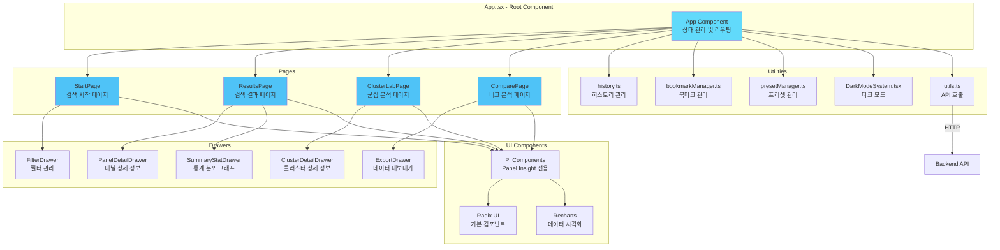
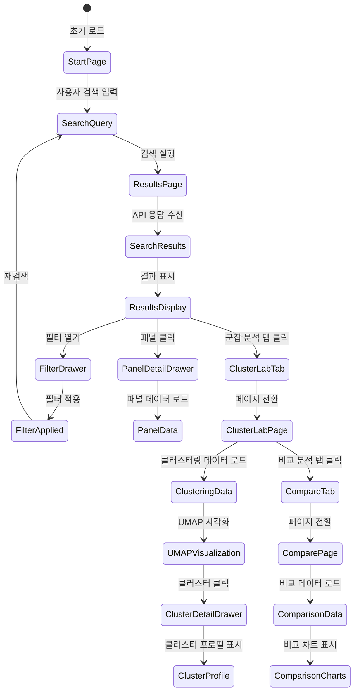
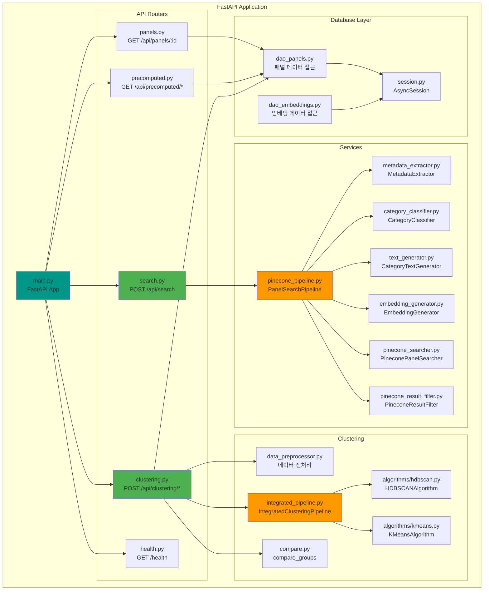
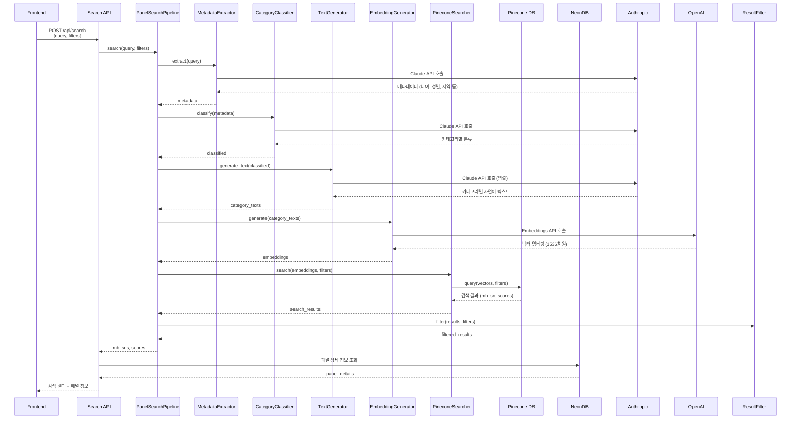
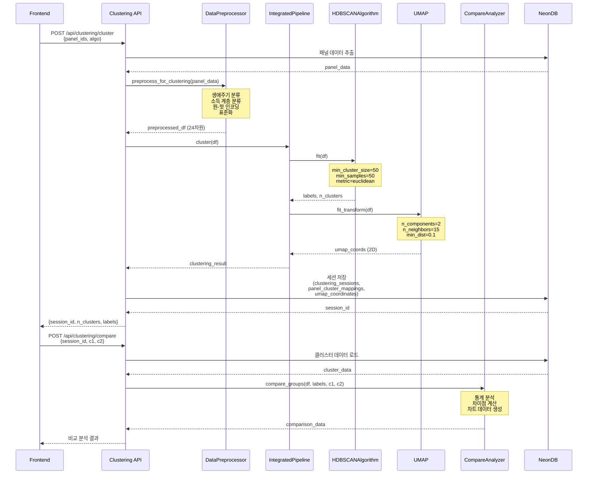
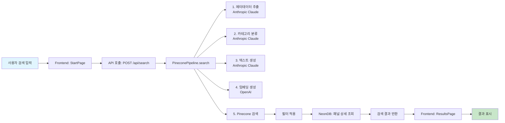
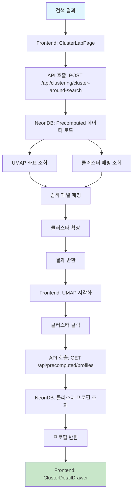
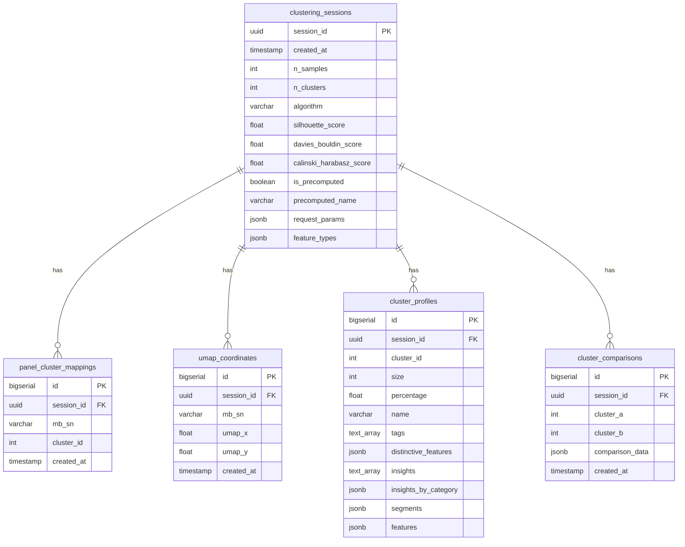
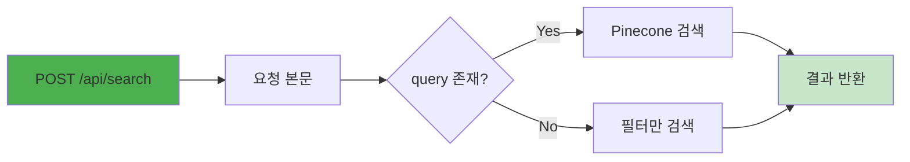
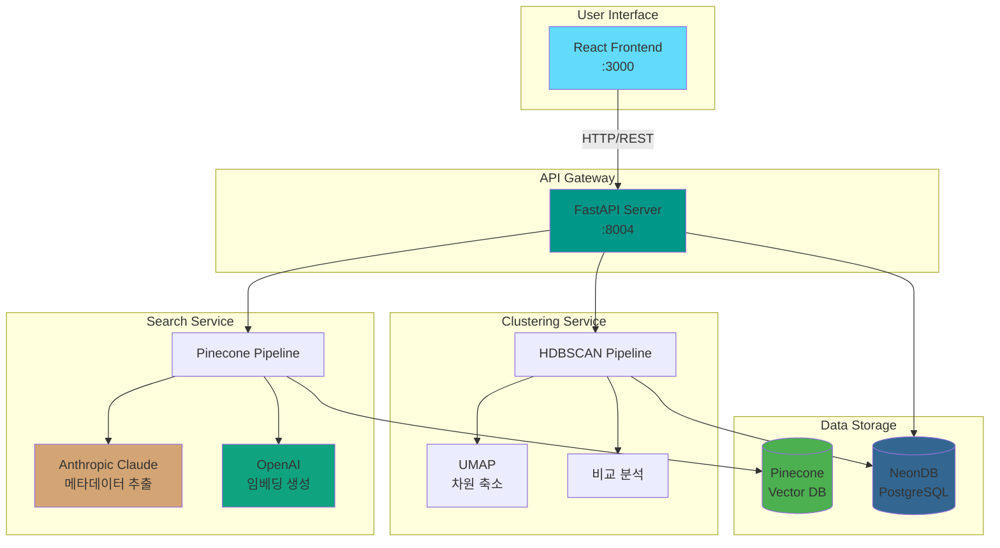

# Panel Insight 시스템 아키텍처

## 목차
1. [시스템 개요](#시스템-개요)
2. [전체 아키텍처 다이어그램](#전체-아키텍처-다이어그램)
3. [프론트엔드 아키텍처](#프론트엔드-아키텍처)
4. [백엔드 아키텍처](#백엔드-아키텍처)
5. [데이터 흐름](#데이터-흐름)
6. [주요 컴포넌트 상세](#주요-컴포넌트-상세)
7. [데이터베이스 스키마](#데이터베이스-스키마)
8. [API 엔드포인트](#api-엔드포인트)

---

## 시스템 개요

Panel Insight은 React와 FastAPI로 구축된 종합 패널 분석 및 클러스터링 플랫폼입니다. 의미 기반 벡터 검색, 사전 클러스터링 기반 군집 분석, 그리고 다양한 시각화를 통한 그룹 비교 분석을 제공합니다.

### 핵심 기능
- **의미 기반 벡터 검색**: Pinecone과 OpenAI Embeddings를 활용한 임베딩 기반 검색
- **HDBSCAN 클러스터링**: 밀도 기반 자동 클러스터링 (19개 클러스터)
- **UMAP 시각화**: 2D 공간에서의 인터랙티브 클러스터 탐색
- **비교 분석**: 그룹 간 다차원 비교 (레이더 차트, 히트맵, 스택 바, 인덱스 도트 플롯)

### 기술 스택
- **Frontend**: React 18, TypeScript, Vite, Tailwind CSS, Radix UI, Framer Motion, Recharts
- **Backend**: FastAPI, Python 3.13, SQLAlchemy (비동기), Uvicorn
- **Database**: NeonDB (PostgreSQL), Pinecone (벡터 검색)
- **ML/AI**: HDBSCAN, UMAP, OpenAI Embeddings, Anthropic Claude

---

## 전체 아키텍처 다이어그램

```mermaid
graph TB
    subgraph "Client Layer"
        Browser[브라우저]
        React[React App<br/>Vite Dev Server<br/>:3000]
    end
    
    subgraph "Frontend Application"
        StartPage[StartPage<br/>검색 시작]
        ResultsPage[ResultsPage<br/>검색 결과]
        ClusterLabPage[ClusterLabPage<br/>군집 분석]
        ComparePage[ComparePage<br/>비교 분석]
        
        FilterDrawer[FilterDrawer<br/>필터 관리]
        PanelDetailDrawer[PanelDetailDrawer<br/>패널 상세]
        ClusterDetailDrawer[ClusterDetailDrawer<br/>클러스터 상세]
        ExportDrawer[ExportDrawer<br/>데이터 내보내기]
    end
    
    subgraph "Backend API Server"
        FastAPI[FastAPI Server<br/>:8004]
        
        subgraph "API Routes"
            SearchAPI[/api/search<br/>벡터 검색]
            PanelsAPI[/api/panels<br/>패널 상세]
            ClusteringAPI[/api/clustering<br/>클러스터링]
            PrecomputedAPI[/api/precomputed<br/>사전 계산 데이터]
            HealthAPI[/health<br/>헬스 체크]
        end
        
        subgraph "Services Layer"
            PineconePipeline[PineconePipeline<br/>검색 파이프라인]
            MetadataExtractor[MetadataExtractor<br/>메타데이터 추출]
            EmbeddingGenerator[EmbeddingGenerator<br/>임베딩 생성]
            CategoryClassifier[CategoryClassifier<br/>카테고리 분류]
        end
        
        subgraph "Clustering Layer"
            DataPreprocessor[DataPreprocessor<br/>데이터 전처리]
            HDBSCAN[HDBSCAN<br/>밀도 기반 클러스터링]
            UMAP[UMAP<br/>차원 축소]
            CompareAnalyzer[CompareAnalyzer<br/>비교 분석]
        end
    end
    
    subgraph "Data Layer"
        NeonDB[(NeonDB<br/>PostgreSQL)]
        Pinecone[(Pinecone<br/>Vector DB)]
    end
    
    subgraph "External Services"
        OpenAI[OpenAI API<br/>text-embedding-3-small]
        Anthropic[Anthropic Claude<br/>메타데이터 추출]
    end
    
    Browser --> React
    React --> StartPage
    React --> ResultsPage
    React --> ClusterLabPage
    React --> ComparePage
    
    StartPage --> FilterDrawer
    ResultsPage --> PanelDetailDrawer
    ClusterLabPage --> ClusterDetailDrawer
    ComparePage --> ExportDrawer
    
    StartPage -->|HTTP/REST| FastAPI
    ResultsPage -->|HTTP/REST| FastAPI
    ClusterLabPage -->|HTTP/REST| FastAPI
    ComparePage -->|HTTP/REST| FastAPI
    
    FastAPI --> SearchAPI
    FastAPI --> PanelsAPI
    FastAPI --> ClusteringAPI
    FastAPI --> PrecomputedAPI
    FastAPI --> HealthAPI
    
    SearchAPI --> PineconePipeline
    PineconePipeline --> MetadataExtractor
    PineconePipeline --> CategoryClassifier
    PineconePipeline --> EmbeddingGenerator
    PineconePipeline --> Pinecone
    
    ClusteringAPI --> DataPreprocessor
    ClusteringAPI --> HDBSCAN
    ClusteringAPI --> UMAP
    ClusteringAPI --> CompareAnalyzer
    
    PanelsAPI --> NeonDB
    PrecomputedAPI --> NeonDB
    ClusteringAPI --> NeonDB
    
    MetadataExtractor --> Anthropic
    CategoryClassifier --> Anthropic
    EmbeddingGenerator --> OpenAI
    
    PineconePipeline --> Pinecone
    
    style React fill:#61dafb
    style FastAPI fill:#009688
    style NeonDB fill:#336791
    style Pinecone fill:#4caf50
    style OpenAI fill:#10a37f
    style Anthropic fill:#d4a574
```

---

## 프론트엔드 아키텍처

### 컴포넌트 계층 구조



### 상태 관리 흐름



---

## 백엔드 아키텍처

### API 라우터 구조



### 검색 파이프라인 상세



### 클러스터링 파이프라인 상세



---

## 데이터 흐름

### 검색 요청 흐름



### 클러스터링 요청 흐름



---

## 주요 컴포넌트 상세

### 1. Frontend 컴포넌트

#### StartPage
- **역할**: 검색 시작 페이지
- **기능**: 
  - 검색어 입력
  - Quick Actions (빠른 검색)
  - 프리셋 관리
- **상태**: query, filters

#### ResultsPage
- **역할**: 검색 결과 표시
- **기능**:
  - 검색 결과 테이블/카드 뷰
  - 페이지네이션
  - SummaryBar (통계 요약)
  - 필터 적용
- **상태**: searchResults, totalResults, page

#### ClusterLabPage
- **역할**: 군집 분석 시각화
- **기능**:
  - UMAP 2D 시각화
  - 클러스터 필터링
  - 검색 패널 하이라이트
  - 클러스터 프로필 표시
- **상태**: umapData, clusters, selectedClusters

#### ComparePage
- **역할**: 그룹 비교 분석
- **기능**:
  - 레이더 차트 (8개 핵심 지표)
  - 히트맵 (이진 변수)
  - 스택 바 차트 (범주형 변수)
  - 인덱스 도트 플롯
  - 변수 선택 패널
- **상태**: comparisonData, selectedGroups

### 2. Backend 서비스

#### PanelSearchPipeline
- **역할**: 전체 검색 파이프라인 관리
- **단계**:
  1. 메타데이터 추출 (Anthropic Claude)
  2. 카테고리 분류 (Anthropic Claude)
  3. 자연어 텍스트 생성 (Anthropic Claude)
  4. 임베딩 생성 (OpenAI)
  5. Pinecone 검색 및 필터링

#### IntegratedClusteringPipeline
- **역할**: 통합 클러스터링 파이프라인
- **구성**:
  - Filter: PanelFilter
  - Processor: VectorProcessor
  - Algorithm: HDBSCAN/K-Means/MiniBatch K-Means
- **전략**: 동적 전략 선택 (샘플 수에 따라)

#### DataPreprocessor
- **역할**: 클러스터링용 데이터 전처리
- **과정**:
  1. 생애주기 분류 (6단계)
  2. 소득 계층 분류 (3분위)
  3. 초기 세그먼트 생성 (18개)
  4. 원-핫 인코딩
  5. 추가 피처 결합 (6개 연속형 변수)
  6. 표준화 (StandardScaler)

---

## 데이터베이스 스키마

### NeonDB 스키마 구조



### 주요 테이블 설명

#### clustering_sessions
- 클러스터링 세션 메타데이터
- 알고리즘, 메트릭, 파라미터 저장
- Precomputed 세션 여부 표시

#### panel_cluster_mappings
- 패널-클러스터 매핑 정보
- 한 세션에서 한 패널은 하나의 클러스터에만 속함
- cluster_id = -1은 노이즈

#### umap_coordinates
- UMAP 2D 좌표
- 시각화용 (umap_x, umap_y)

#### cluster_profiles
- 클러스터 프로필 정보
- 태그, 인사이트, 세그먼트 정보
- 카테고리별 인사이트

#### cluster_comparisons
- 클러스터 간 비교 분석 결과
- JSONB 형식으로 유연한 비교 데이터 저장

---

## API 엔드포인트

### 검색 API



**엔드포인트**: `POST /api/search`

**요청**:
```json
{
  "query": "서울 20대 여성",
  "filters": {
    "gender": ["여성"],
    "regions": ["서울"],
    "ageRange": [20, 29],
    "income": ["중"],
    "quickpollOnly": false
  },
  "page": 1,
  "limit": 20
}
```

**응답**:
```json
{
  "query": "서울 20대 여성",
  "page": 1,
  "page_size": 20,
  "count": 20,
  "total": 150,
  "pages": 8,
  "mode": "pinecone",
  "results": [
    {
      "mb_sn": "PANEL_001",
      "name": "홍길동",
      "age": 25,
      "gender": "여성",
      "region": "서울",
      "similarity": 0.95
    }
  ]
}
```

### 클러스터링 API

#### 1. 클러스터링 실행
**엔드포인트**: `POST /api/clustering/cluster`

**요청**:
```json
{
  "panel_ids": ["PANEL_001", "PANEL_002", ...],
  "algo": "auto",
  "use_dynamic_strategy": true
}
```

**응답**:
```json
{
  "success": true,
  "session_id": "uuid",
  "n_samples": 2000,
  "n_clusters": 19,
  "labels": [0, 1, 2, ...],
  "cluster_sizes": {0: 150, 1: 200, ...},
  "silhouette_score": 0.6192,
  "davies_bouldin_score": 0.5322,
  "calinski_harabasz_score": 7756.84,
  "n_clusters": 18,
  "n_noise": 41,
  "noise_ratio": 0.002
  "davies_bouldin_score": 0.6872,
  "calinski_harabasz_score": 6385.79
}
```

#### 2. 검색 결과 주변 클러스터링
**엔드포인트**: `POST /api/clustering/cluster-around-search`

**요청**:
```json
{
  "search_panel_ids": ["PANEL_001", "PANEL_002"],
  "k_neighbors_per_panel": 100
}
```

**응답**:
```json
{
  "success": true,
  "session_id": "search_extended_xxx",
  "n_total_panels": 500,
  "n_search_panels": 2,
  "n_extended_panels": 498,
  "n_clusters": 3,
  "panels": [
    {
      "panel_id": "PANEL_001",
      "umap_x": 0.5,
      "umap_y": 0.3,
      "cluster": 5,
      "is_search_result": true
    }
  ],
  "cluster_stats": {
    "5": {
      "size": 200,
      "percentage": 40.0,
      "search_count": 2,
      "search_percentage": 1.0
    }
  }
}
```

#### 3. 클러스터 비교
**엔드포인트**: `POST /api/clustering/compare`

**요청**:
```json
{
  "session_id": "uuid",
  "c1": 0,
  "c2": 1
}
```

**응답**:
```json
{
  "comparison": [
    {
      "variable": "age",
      "type": "numeric",
      "cluster_0": {"mean": 35.2, "std": 8.5},
      "cluster_1": {"mean": 42.1, "std": 9.2},
      "difference": 6.9,
      "lift": 1.20
    }
  ]
}
```

### 사전 계산 데이터 API

#### 1. 클러스터 정보
**엔드포인트**: `GET /api/precomputed/clusters`

**응답**:
```json
{
  "clusters": [
    {
      "cluster_id": 0,
      "size": 150,
      "percentage": 7.5
    }
  ]
}
```

#### 2. UMAP 좌표
**엔드포인트**: `GET /api/precomputed/umap`

**응답**:
```json
{
  "coordinates": [
    {
      "mb_sn": "PANEL_001",
      "umap_x": 0.5,
      "umap_y": 0.3,
      "cluster": 0
    }
  ]
}
```

#### 3. 클러스터 프로필
**엔드포인트**: `GET /api/precomputed/profiles?session_id=xxx&cluster_id=0`

**응답**:
```json
{
  "cluster_id": 0,
  "size": 150,
  "percentage": 7.5,
  "name": "젊은 싱글 고소득",
  "tags": ["프리미엄", "디지털 네이티브"],
  "insights": ["...", "..."],
  "insights_by_category": {
    "인구통계": ["..."],
    "소비패턴": ["..."]
  },
  "segments": {
    "life_stage": "Young Singles",
    "value_level": "High"
  }
}
```

### 패널 API

#### 패널 상세 정보
**엔드포인트**: `GET /api/panels/{panel_id}`

**응답**:
```json
{
  "mb_sn": "PANEL_001",
  "name": "홍길동",
  "age": 25,
  "gender": "여성",
  "region": "서울",
  "tags": ["프리미엄", "디지털"],
  "insights": ["..."],
  "responses": {...}
}
```

---

## 시스템 통합 다이어그램



---

## 결론

Panel Insight은 다음과 같은 아키텍처 특징을 가집니다:

1. **계층화된 구조**: Frontend → API → Services → Data Layer
2. **비동기 처리**: FastAPI + SQLAlchemy 비동기 ORM
3. **마이크로서비스 스타일**: 검색, 클러스터링, 비교 분석이 독립적인 서비스로 구성
4. **외부 서비스 통합**: Pinecone, OpenAI, Anthropic Claude
5. **데이터 지속성**: NeonDB에 모든 클러스터링 결과 저장
6. **확장 가능성**: Precomputed 데이터로 빠른 응답

이 아키텍처는 대규모 패널 데이터를 효율적으로 검색하고 분석할 수 있도록 설계되었습니다.

