# Panel Insight 시스템 아키텍처 - Mermaid 다이어그램

## 1. 전체 시스템 아키텍처

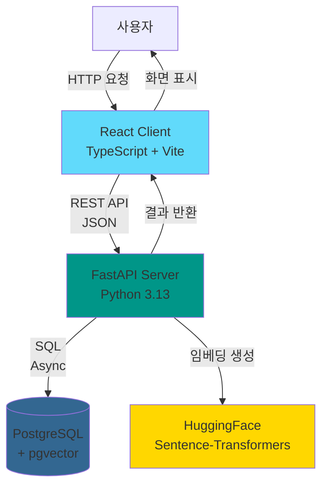

## 2. 백엔드 레이어드 아키텍처

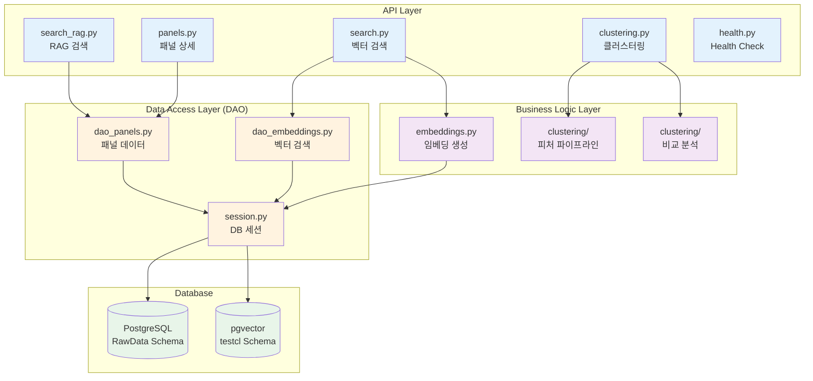

## 3. 프론트엔드 컴포넌트 구조

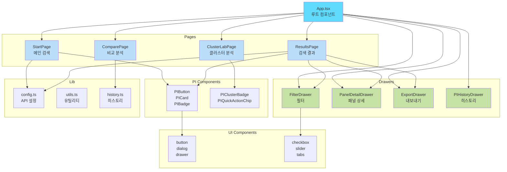

## 4. 검색 흐름 다이어그램

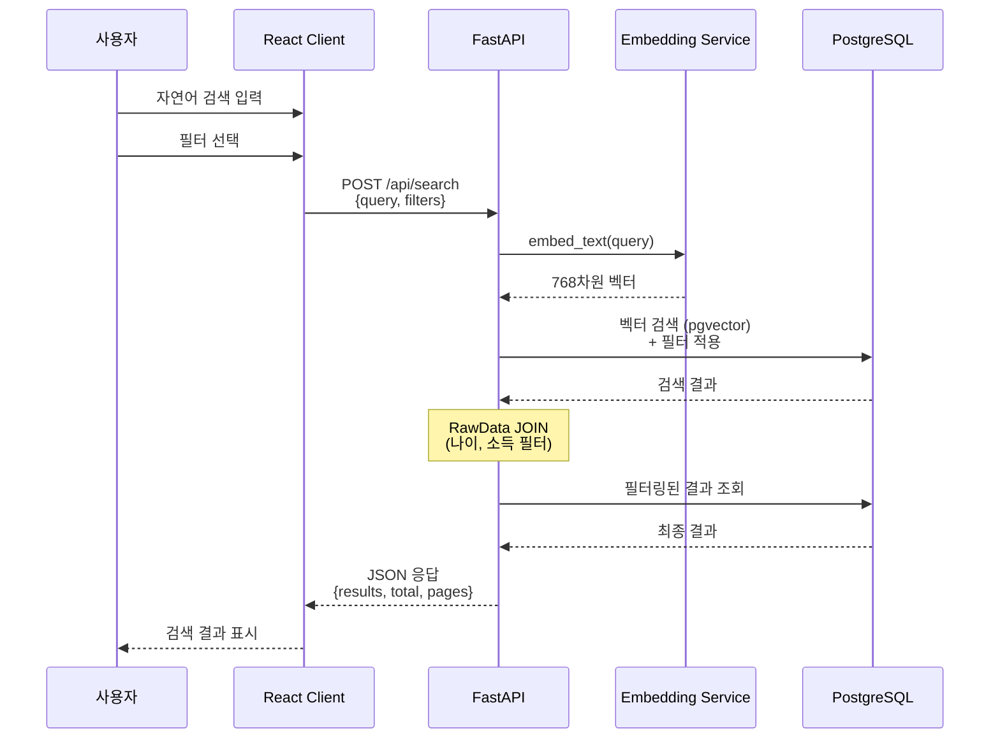

## 5. 필터 처리 흐름

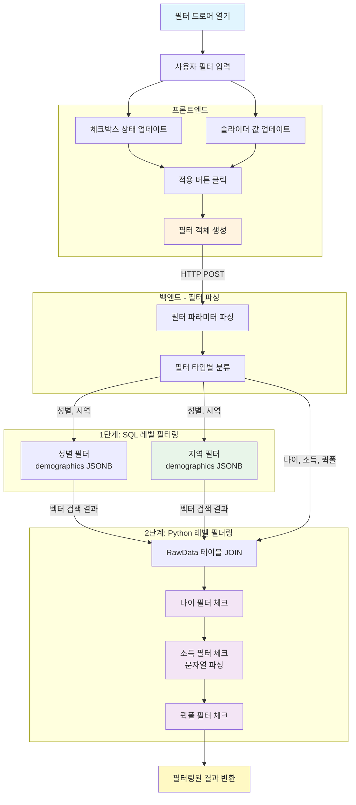

## 6. 클러스터링 흐름

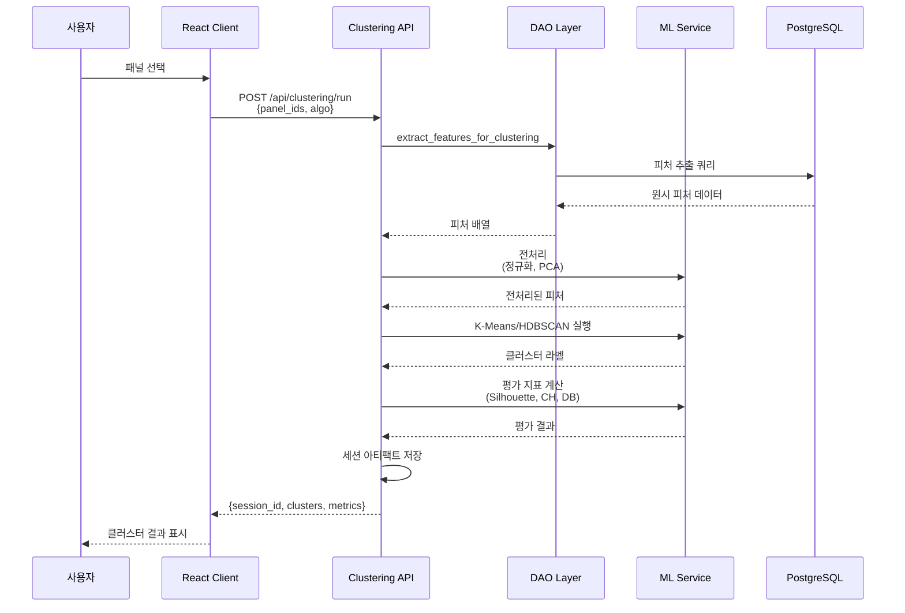

## 7. 데이터베이스 스키마 관계

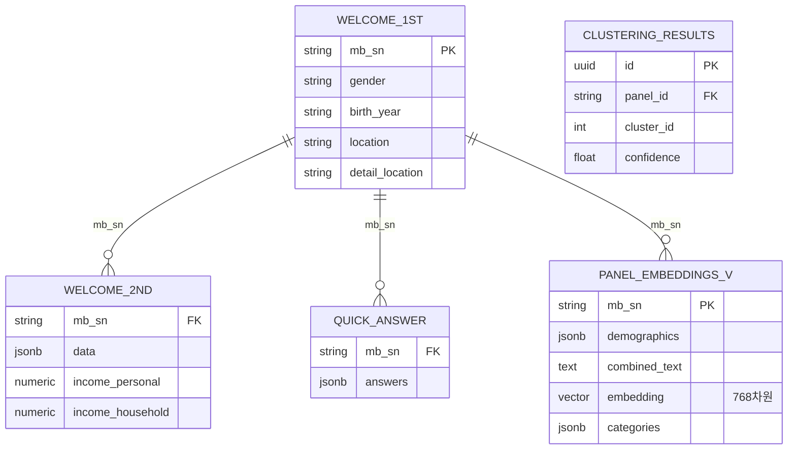

## 8. 필터 타입별 처리 방식

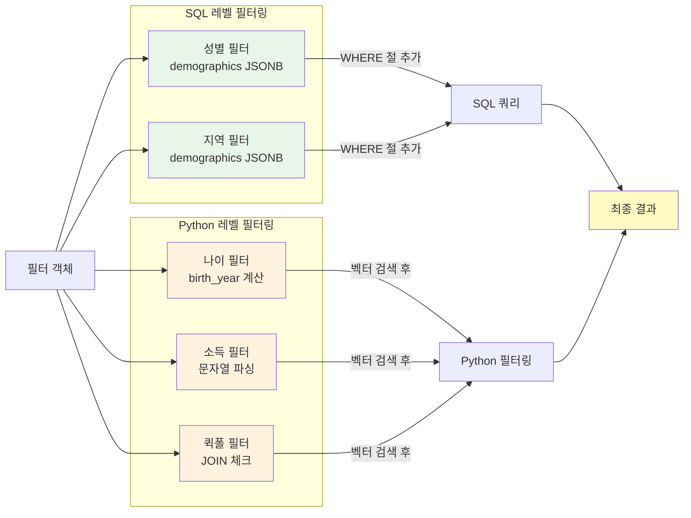

## 9. API 엔드포인트 구조

```mermaid
graph TB
    Root[FastAPI App]
    
    subgraph "Search APIs"
        S1[POST /api/search<br/>벡터 검색]
        S2[POST /api/search/rag<br/>RAG 검색]
    end
    
    subgraph "Panel APIs"
        P1[GET /api/panels/{id}<br/>패널 상세]
    end
    
    subgraph "Clustering APIs"
        C1[POST /api/clustering/run<br/>클러스터링 실행]
        C2[POST /api/clustering/compare<br/>그룹 비교]
        C3[POST /api/clustering/umap<br/>UMAP 좌표]
        C4[GET /api/clustering/sessions<br/>세션 목록]
    end
    
    subgraph "Health APIs"
        H1[GET /health<br/>기본 체크]
        H2[GET /health/db<br/>DB 연결]
    end
    
    Root --> S1
    Root --> S2
    Root --> P1
    Root --> C1
    Root --> C2
    Root --> C3
    Root --> C4
    Root --> H1
    Root --> H2
    
    style S1 fill:#e3f2fd
    style S2 fill:#e3f2fd
    style P1 fill:#e3f2fd
    style C1 fill:#f3e5f5
    style C2 fill:#f3e5f5
    style C3 fill:#f3e5f5
    style C4 fill:#f3e5f5
    style H1 fill:#fff3e0
    style H2 fill:#fff3e0
```

## 10. 전체 시스템 상호작용

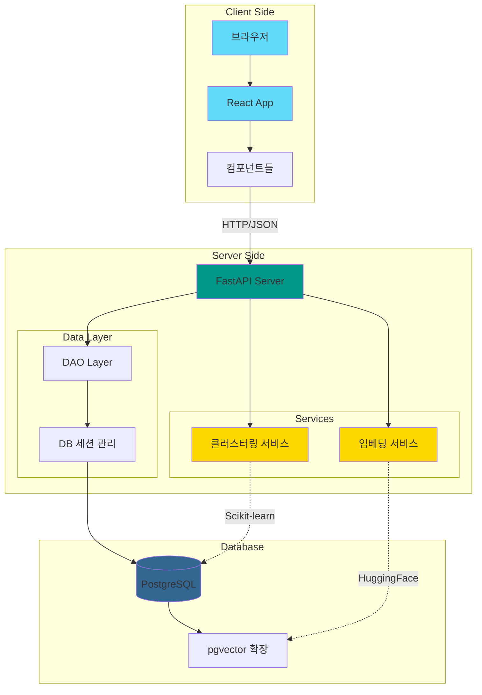

## 11. 시스템 전체 흐름도 (사용자 시나리오)

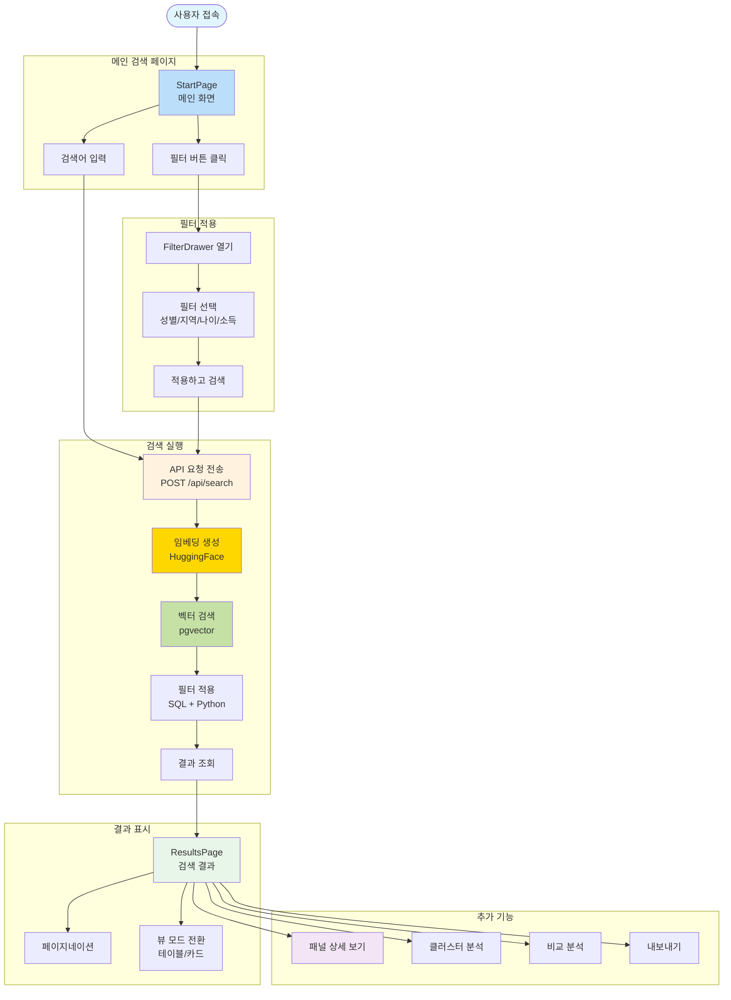

## 12. 검색 및 필터 처리 상세 흐름도

```mermaid
flowchart TD
    UserInput[사용자 입력]
    
    subgraph "프론트엔드 처리"
        ParseInput[입력 파싱]
        BuildFilter[필터 객체 생성]
        FormatRequest[요청 포맷팅]
    end
    
    subgraph "API 라우팅"
        ReceiveRequest[요청 수신<br/>POST /api/search]
        ValidateInput[입력 검증]
        ParseFilters[필터 파싱]
    end
    
    subgraph "임베딩 생성"
        EmbedText[텍스트 → 임베딩<br/>768차원]
        Normalize[벡터 정규화]
    end
    
    subgraph "벡터 검색 1단계"
        SQLFilter[SQL 레벨 필터링<br/>성별/지역]
        VectorQuery[pgvector 쿼리<br/>cosine similarity]
        TopK[상위 K개 결과<br/>유사도 >= 0.9]
    end
    
    subgraph "필터링 2단계"
        JoinRawData[RawData JOIN<br/>나이/소득/퀵폴]
        FilterAge[나이 필터 체크]
        FilterIncome[소득 필터 체크<br/>문자열 파싱]
        FilterQuickpoll[퀵폴 필터 체크]
    end
    
    subgraph "결과 처리"
        Paginate[페이지네이션]
        FormatResponse[응답 포맷팅]
        SendResponse[JSON 응답]
    end
    
    subgraph "프론트엔드 표시"
        RenderResults[결과 렌더링]
        UpdateUI[UI 업데이트]
    end
    
    UserInput --> ParseInput
    ParseInput --> BuildFilter
    BuildFilter --> FormatRequest
    
    FormatRequest --> ReceiveRequest
    ReceiveRequest --> ValidateInput
    ValidateInput --> ParseFilters
    
    ParseFilters --> EmbedText
    EmbedText --> Normalize
    Normalize --> SQLFilter
    
    SQLFilter --> VectorQuery
    VectorQuery --> TopK
    TopK --> JoinRawData
    
    JoinRawData --> FilterAge
    FilterAge --> FilterIncome
    FilterIncome --> FilterQuickpoll
    FilterQuickpoll --> Paginate
    
    Paginate --> FormatResponse
    FormatResponse --> SendResponse
    
    SendResponse --> RenderResults
    RenderResults --> UpdateUI
    
    style UserInput fill:#e1f5fe
    style EmbedText fill:#ffd700
    style VectorQuery fill:#c5e1a5
    style JoinRawData fill:#fff3e0
    style FilterAge fill:#f3e5f5
    style FilterIncome fill:#f3e5f5
    style FilterQuickpoll fill:#f3e5f5
    style UpdateUI fill:#e8f5e9
```

## 13. 클러스터링 전체 흐름도

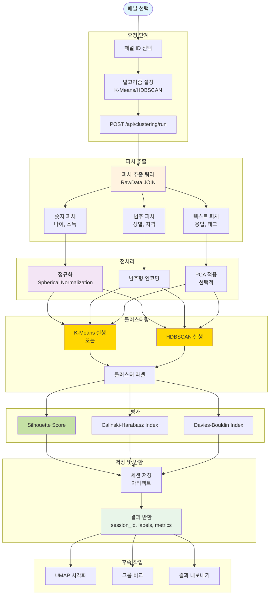

## 14. 비교 분석 흐름도

```mermaid
flowchart TD
    Start([그룹 비교 시작])
    
    subgraph "그룹 선택"
        SelectSession[세션 선택<br/>session_id]
        SelectGroup1[그룹 1 선택<br/>cluster_id]
        SelectGroup2[그룹 2 선택<br/>cluster_id]
        SendCompareRequest[POST /api/clustering/compare]
    end
    
    subgraph "데이터 로드"
        LoadSession[세션 아티팩트 로드]
        LoadGroup1[그룹 1 데이터]
        LoadGroup2[그룹 2 데이터]
    end
    
    subgraph "통계 분석"
        subgraph "연속형 피처"
            CalcSMD[SMD 계산<br/>Standardized Mean Difference]
            SortSMD[|SMD| 내림차순 정렬]
        end
        
        subgraph "범주/이진 피처"
            CalcJSD[JSD 계산<br/>Jensen-Shannon Divergence]
            SortJSD[JSD 내림차순 정렬]
        end
    end
    
    subgraph "결과 생성"
        CreateRankings[Rankings 생성]
        ExtractHighlights[Highlights 추출<br/>상위 N개]
        FormatResults[결과 포맷팅]
    end
    
    subgraph "시각화"
        RenderChart[차트 렌더링<br/>Bar/Line]
        ShowTable[비교 테이블]
        Export[내보내기<br/>CSV/PNG]
    end
    
    Start --> SelectSession
    SelectSession --> SelectGroup1
    SelectGroup1 --> SelectGroup2
    SelectGroup2 --> SendCompareRequest
    
    SendCompareRequest --> LoadSession
    LoadSession --> LoadGroup1
    LoadSession --> LoadGroup2
    
    LoadGroup1 --> CalcSMD
    LoadGroup2 --> CalcSMD
    LoadGroup1 --> CalcJSD
    LoadGroup2 --> CalcJSD
    
    CalcSMD --> SortSMD
    CalcJSD --> SortJSD
    
    SortSMD --> CreateRankings
    SortJSD --> CreateRankings
    
    CreateRankings --> ExtractHighlights
    ExtractHighlights --> FormatResults
    
    FormatResults --> RenderChart
    FormatResults --> ShowTable
    FormatResults --> Export
    
    style Start fill:#e1f5fe
    style CalcSMD fill:#ffd700
    style CalcJSD fill:#ffd700
    style CreateRankings fill:#c5e1a5
    style FormatResults fill:#e8f5e9
```

## 15. 패널 상세 조회 흐름도

```mermaid
flowchart TD
    Start([패널 클릭])
    
    subgraph "요청"
        ClickPanel[패널 카드/행 클릭]
        GetPanelId[패널 ID 추출]
        SendRequest[GET /api/panels/{id}]
    end
    
    subgraph "데이터 조회"
        QueryDB[데이터베이스 쿼리]
        JoinW1[welcome_1st JOIN<br/>기본 인구통계]
        JoinW2[welcome_2nd JOIN<br/>상세 응답 JSONB]
        JoinQA[quick_answer JOIN<br/>빠른 응답 JSONB]
        JoinEmb[panel_embeddings_v JOIN<br/>임베딩 정보]
    end
    
    subgraph "데이터 파싱"
        ParseDemographics[인구통계 파싱<br/>성별/나이/지역]
        ParseResponses[응답 이력 파싱<br/>JSONB → 배열]
        ParseTags[태그 파싱<br/>categories JSONB]
        ExtractIncome[소득 정보 추출]
    end
    
    subgraph "표시 준비"
        FormatData[데이터 포맷팅]
        GenerateSummary[AI 요약 생성<br/>선택적]
        PrepareTimeline[타임라인 구성]
    end
    
    subgraph "UI 표시"
        OpenDrawer[PanelDetailDrawer 열기]
        ShowBasic[기본 정보 표시]
        ShowHistory[응답 이력 표시]
        ShowTags[태그 표시]
        ShowSummary[요약 표시]
    end
    
    Start --> ClickPanel
    ClickPanel --> GetPanelId
    GetPanelId --> SendRequest
    
    SendRequest --> QueryDB
    QueryDB --> JoinW1
    QueryDB --> JoinW2
    QueryDB --> JoinQA
    QueryDB --> JoinEmb
    
    JoinW1 --> ParseDemographics
    JoinW2 --> ParseResponses
    JoinEmb --> ParseTags
    JoinW2 --> ExtractIncome
    
    ParseDemographics --> FormatData
    ParseResponses --> FormatData
    ParseTags --> FormatData
    ExtractIncome --> FormatData
    
    FormatData --> GenerateSummary
    FormatData --> PrepareTimeline
    
    GenerateSummary --> OpenDrawer
    PrepareTimeline --> OpenDrawer
    
    OpenDrawer --> ShowBasic
    OpenDrawer --> ShowHistory
    OpenDrawer --> ShowTags
    OpenDrawer --> ShowSummary
    
    style Start fill:#e1f5fe
    style QueryDB fill:#fff3e0
    style ParseDemographics fill:#f3e5f5
    style FormatData fill:#c5e1a5
    style OpenDrawer fill:#e8f5e9
```

## 16. 전체 시스템 워크플로우 (통합)

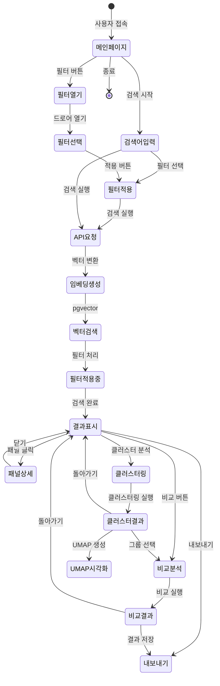

