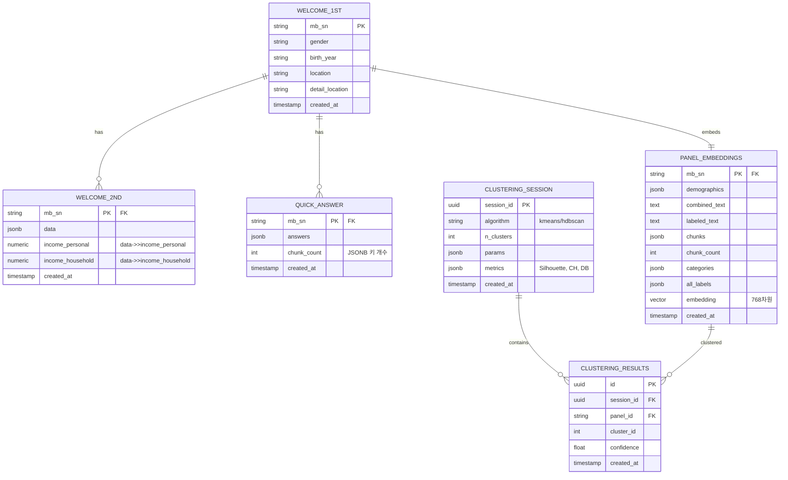

# Panel Insight 프로젝트 - 추가 다이어그램

## 1. 요구사항 분석 다이어그램

### 1.1 기능 요구사항 매트릭스


### 1.2 사용자 스토리 맵


## 2. 화면 설계 다이어그램

### 2.1 화면 구성도 (Screen Flow)


### 2.2 사용자 여정 다이어그램 (User Journey)


## 3. 데이터 설계 다이어그램 (상세)

### 3.1 데이터 흐름도 (DFD)


### 3.2 데이터베이스 스키마 상세 (정규화 전/후)



## 4. 인터페이스 설계 다이어그램

### 4.1 API 인터페이스 구조

```mermaid
graph TB
    subgraph "Client Layer"
        React[React Client]
        API_Client[API Client<br/>utils.ts]
    end
    
    subgraph "API Gateway"
        FastAPI[FastAPI Router]
        CORS[CORS Middleware]
        Validation[Pydantic Validation]
    end
    
    subgraph "API Endpoints"
        SearchAPI[POST /api/search]
        PanelAPI[GET /api/panels/{id}]
        ClusterAPI[POST /api/clustering/*]
        HealthAPI[GET /health/*]
    end
    
    subgraph "Request/Response"
        Req1[SearchRequest<br/>query, filters, page]
        Res1[SearchResponse<br/>results, total, pages]
        
        Req2[ClusterRequest<br/>panel_ids, algo, params]
        Res2[ClusterResponse<br/>session_id, labels, metrics]
    end
    
    React --> API_Client
    API_Client -->|HTTP/JSON| FastAPI
    FastAPI --> CORS
    CORS --> Validation
    
    Validation --> SearchAPI
    Validation --> PanelAPI
    Validation --> ClusterAPI
    Validation --> HealthAPI
    
    SearchAPI --> Req1
    SearchAPI --> Res1
    
    ClusterAPI --> Req2
    ClusterAPI --> Res2
    
    Res1 --> API_Client
    Res2 --> API_Client
    API_Client --> React
    
    style React fill:#61dafb
    style FastAPI fill:#009688
    style SearchAPI fill:#ffd700
    style Res1 fill:#c5e1a5
```

### 4.2 컴포넌트 간 통신 구조


## 5. 프로젝트 일정 및 이슈 관리

### 5.1 추진 일정 (간트 차트)


### 5.2 이슈 관리 및 대응 방안


## 6. 기술 스택 비교 및 선택 근거

### 6.1 기술 스택 비교 매트릭스


### 6.2 아키텍처 패턴 선택 근거


## 7. 성능 최적화 전략

### 7.1 성능 병목 지점 및 해결 방안


## 8. 보안 설계

### 8.1 보안 계층 구조


---

## 다이어그램 활용 가이드

### 보고서 섹션별 다이어그램 매핑

| 보고서 섹션 | 추천 다이어그램 |
|------------|----------------|
| **요구사항 분석** | 1. 기능 요구사항 매트릭스, 1.2 사용자 스토리 맵 |
| **화면설계** | 2.1 화면 구성도, 2.2 사용자 여정 다이어그램 |
| **데이터설계** | 3.1 데이터 흐름도, 3.2 데이터베이스 스키마 상세 |
| **인터페이스 설계** | 4.1 API 인터페이스 구조, 4.2 컴포넌트 간 통신 구조 |
| **추진 일정** | 5.1 추진 일정 (간트 차트) |
| **이슈사항 및 대응방안** | 5.2 이슈 관리 및 대응 방안 |

### 추가 고려사항

1. **시장 분석**: 기술 스택 비교 매트릭스 (6.1) 활용
2. **성능 최적화**: 7.1 성능 병목 지점 다이어그램
3. **보안**: 8.1 보안 계층 구조

